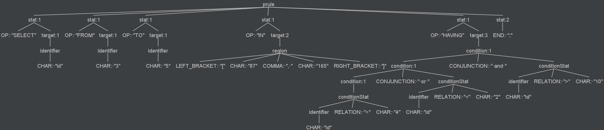

# hesse-sql

A simple sql parser for hesse

## Example

input hesse sql statement:

`SELECT id FROM 3 TO 5 IN [87, 165] HAVING id > 12 or id < 10 and id > 7;`

ast tree:



generated plan:

```shell
{aggregated_attribute=id, from=3, to=5, startT=87, endT=165, conditions=[Interval{leftBound='7', rightBound='10'}, Interval{leftBound='12', rightBound='2147483647'}]}
```